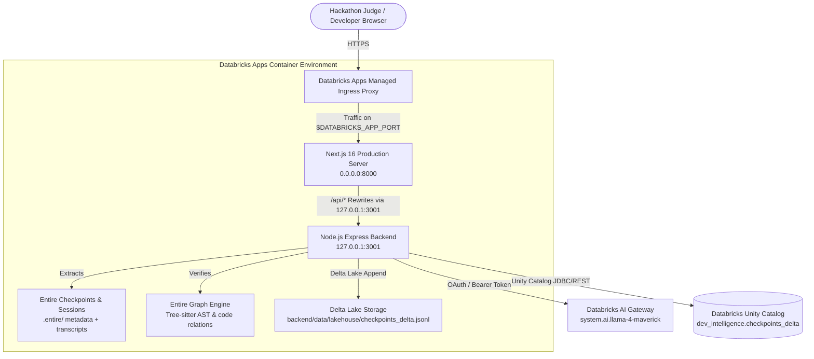

# 🚀 Databricks Apps Deployment Guide
## Code Archaeologist — AI Development Intelligence Command Center

This guide provides step-by-step instructions to deploy and host the complete **Code Archaeologist** platform (Next.js frontend + Express backend + Databricks AI Gateway + Delta Lake + Entire Engine) on **Databricks Apps**.

---

## 🏗 Architecture on Databricks Apps

Databricks Apps runs containerized serverless workloads with a single managed ingress port (`$DATABRICKS_APP_PORT`, typically `8000` or `8080`).



### Key Components Included in This Repository
| File | Purpose |
|---|---|
| `app.yaml` | Official Databricks Apps manifest declaring entry command and environment variables. |
| `databricks.yml` | Databricks Asset Bundle (DAB) configuration for programmatic deployment. |
| `deploy/start.sh` | Orchestrator script that starts backend on loopback, validates health, and binds Next.js to `$DATABRICKS_APP_PORT`. |
| `deploy/deploy.sh` | One-command CLI deployer for automated deployment. |
| `next.config.mjs` | Configured to dynamically proxy `/api/*` to `127.0.0.1:$BACKEND_PORT`. |

---

## 📋 Prerequisites

1. **Databricks Workspace**: An active Databricks workspace with **Apps** enabled (for example, `https://your-workspace.cloud.databricks.com/`).
2. **Databricks Compute / Serverless**: Serverless compute enabled for Databricks Apps.
3. **Foundation Model Access**: Access to `system.ai.llama-4-maverick` (or `databricks-meta-llama-3-3-70b-instruct`).
4. **Git Repository**: This repository pushed to GitHub or imported into your Databricks Workspace Git Folders.

## ✅ Master Branch Deployment Checklist

Databricks Apps is expected to deploy this project from the `master` branch.

Before redeploying from the Databricks UI:
1. Commit the deployment files locally: `deploy/start.sh`, `app.yaml`, `deploy/deploy.sh`, and any runtime code changes.
2. Push the commit to `origin/master`.
3. In Databricks Git Folders, confirm the selected branch is `master` and pull the latest revision if needed.
4. Redeploy the App from that Git Folder.

If using the local CLI deployer, `npm run deploy:databricks` now refuses to deploy from a branch other than `master` unless `CODE_ARCHAEOLOGIST_DEPLOY_BRANCH` is set intentionally.

---

## 🎯 Deployment Method 1: Databricks Workspace UI (Zero-CLI / Recommended)

This is the fastest method to deploy directly from the Databricks Web Console.

### Step 1: Import Code into Databricks Git Folders
1. In your Databricks Workspace, click **Workspace** in the left sidebar.
2. Navigate to **Users > your-username** or **Repos**.
3. Click **Add > Git Folder**.
4. Enter your Git URL (e.g. `https://github.com/your-username/Code-Archaeologist.git`) and branch (`master`).
5. Click **Create Git Folder**.

### Step 2: Create New App
1. In the left sidebar, click **Compute** and switch to the **Apps** tab (or select **Apps** from the application switcher).
2. Click the blue **Create App** button in the top right.
3. Set the configuration:
   - **App Name**: `code-archaeologist`
   - **Description**: `Code Archaeologist — AI Development Intelligence Command Center`
   - **Source Code**: Select **Git Folder** or **Workspace Files** and browse to `/Workspace/Users/your-username/Code-Archaeologist`.

### Step 3: Configure Environment Variables
In the **App Settings** or **Environment Variables** section, enter the following key-value pairs:

| Variable | Value | Description |
|---|---|---|
| `NODE_ENV` | `production` | Enables Next.js production optimizations |
| `BACKEND_PORT` | `3001` | Internal backend port (loopback) |
| `DATABRICKS_MODEL_ENDPOINT` | `system.ai.llama-4-maverick` | Databricks AI Gateway model |
| `DATABRICKS_API_MODE` | `auto` | Auto-detects chat completions vs model serving |
| `DATABRICKS_TOKEN` | `dapi...` *(optional)* | Personal Access Token or leave empty to use App's managed Service Principal |

*(Note: `DATABRICKS_HOST` and `DATABRICKS_APP_PORT` are automatically injected by Databricks Apps).*

### Step 4: Grant Permissions to the App Service Principal
When the App is created, Databricks generates a Service Principal for it:
1. Navigate to **Serving** in Databricks.
2. Select your Model Endpoint (e.g. `system.ai.llama-4-maverick` or custom endpoint).
3. Click **Permissions** and grant `CAN_USE` or `CAN_QUERY` to `app-code-archaeologist`.
4. If writing directly to Unity Catalog: grant `USE CATALOG`, `USE SCHEMA`, and `MODIFY` on your target catalog and schema (e.g. `dev_intelligence`).

### Step 5: Click Deploy
1. Click **Deploy** in the top right.
2. Databricks will:
   - Read `app.yaml`.
   - Run `deploy/start.sh`.
   - Install dependencies and build Next.js.
   - Start backend on `127.0.0.1:3001` and Next.js on `0.0.0.0:$DATABRICKS_APP_PORT`.
3. Once the status shows **Running** (green dot), click the **App URL** to open your live dashboard!

---

## 💻 Deployment Method 2: Databricks CLI & Asset Bundles (DABs)

If you prefer deploying from your local terminal using the Databricks CLI:

### Step 1: Install Databricks CLI (v0.200+)
```bash
# macOS (Homebrew)
brew install databricks/tap/databricks

# Linux / macOS (curl)
curl -fsSL https://raw.githubusercontent.com/databricks/setup-cli/main/install.sh | sh

# Windows
winget install Databricks.DatabricksCLI
```

Verify installation:
```bash
databricks version
```

### Step 2: Authenticate with Your Workspace
```bash
databricks auth login --host https://your-workspace.cloud.databricks.com/
```

### Step 3: Run the Automated Deployer
We have provided an automated deployment script in `deploy/deploy.sh` and npm script:

```bash
npm run deploy:databricks
```

Or manually:
```bash
# 1. Build the production Next.js bundle
npm run build

# 2. Create the app if not already created
databricks apps create code-archaeologist --description "Code Archaeologist Command Center"

# 3. Deploy the source code
databricks apps deploy code-archaeologist --source-code-path .

# 4. Check status and get the live URL
databricks apps get code-archaeologist
```

### Step 4: Deploying via Databricks Asset Bundles (Alternative)
The included `databricks.yml` allows you to deploy via DABs:
```bash
# Validate bundle definition
databricks bundle validate

# Deploy to development workspace
databricks bundle deploy -t dev

# Run and inspect app
databricks bundle run code_archaeologist
```

---

## 🧪 Local Pre-Flight Verification

Before pushing to Databricks, you can simulate the exact Databricks Apps runtime locally:

```bash
# 1. Run the unified Databricks Apps startup script locally on port 8000
DATABRICKS_APP_PORT=8000 BACKEND_PORT=3001 bash deploy/start.sh
```

Or via npm:
```bash
npm run start:databricks
```

Then visit `http://localhost:8000` in your browser.

---

## 🔍 Verifying the Deployment on Databricks

Once deployed, verify the complete pipeline:

1. **Dashboard Metrics**: Confirm the 4 metric cards load (Checkpoints, Requirements, Graph Verified, Risks).
2. **Databricks AI Gateway Badge**: Look at the top right header badge. It should show:
   `Databricks: Connected (Llama 4 Maverick)`.
3. **Trigger Live Analysis**:
   - In the Checkpoint Selector, pick checkpoint `01M1TKD2E97T4F5PHJKWZR70GQ`.
   - Click **Run Live Pipeline**.
   - Watch the 4-stage pipeline indicator execute:
     `Checkpoint Extraction` ➔ `Databricks Intelligence Analysis` ➔ `Entire Graph Code Verification` ➔ `Agent Handoff JSON`.
4. **Delta Lake Persistence**:
   - Click the **Store in Delta Lake** button in the dashboard header.
   - Verify the analysis is committed to the Delta Lake audit log table.
5. **Resume Prompt Generation**:
   - Switch to the **Handoff Spec** tab.
   - Click **Generate Next Steps with Databricks AI**.
   - Confirm the Databricks Llama 4 Maverick prompt generator outputs an actionable resumption prompt.

---

## 🛠 Troubleshooting & FAQ

### Q: The App deployment shows "CrashLoopBackOff" or "Health check failed"
- **Cause**: Databricks Apps expects HTTP traffic on `0.0.0.0:$DATABRICKS_APP_PORT`. If the server binds only to `localhost` or exits before binding, the ingress health check fails.
- **Solution**: Our `deploy/start.sh` script boots Express first, polls `http://127.0.0.1:3001/api/health`, and then binds Next.js to `0.0.0.0:$DATABRICKS_APP_PORT`. Check the **Logs** tab in the Databricks Apps UI for build or runtime errors.

### Q: Startup fails with `npx: command not found`
- **Cause**: Some Databricks Apps runtime images include `npm` and installed package binaries but do not expose `npx` in the startup shell path.
- **Solution**: `deploy/start.sh` uses the project-local Next.js CLI from `./node_modules/.bin/next`, with a `node ./node_modules/next/dist/bin/next` fallback. Make sure this latest script is committed and pushed to `origin/master` before redeploying from the Databricks UI.

### Q: Databricks AI shows "Fallback Mode" on the deployed app
- **Cause**: The app does not have a valid `DATABRICKS_TOKEN` or permission to query `system.ai.llama-4-maverick`.
- **Solution**:
  1. Add `DATABRICKS_TOKEN` in the App's **Environment Variables** in Databricks Apps settings.
  2. Or grant `CAN_USE` permission on the serving endpoint to the app's service principal `app-code-archaeologist`.

### Q: Next.js API rewrites fail with `ECONNREFUSED`
- **Cause**: In Linux containers, `localhost` may resolve to IPv6 `::1` while Node Express is listening on IPv4 `127.0.0.1`.
- **Solution**: `next.config.mjs` is configured to use `http://127.0.0.1:${backendPort}/api/:path*` and Express binds explicitly to `0.0.0.0`.

---

## 🏆 Hackathon Judge Quick Links
- **Host Workspace**: your configured Databricks workspace URL
- **Foundation Model**: `system.ai.llama-4-maverick` (`meta-llama-4-maverick-040225`)
- **Delta Lake Table**: `dev_intelligence.checkpoints_delta`
- **Primary Data Ref**: Entire Checkpoint `01M1TKD2E97T4F5PHJKWZR70GQ`
